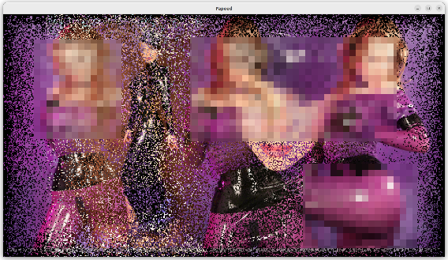

# Fapeed - Adult Slideshow App

Fapeed is a slideshow app optimized for viewing and enjoying adult images. View your favorite images one after another blazing fast or in a dream like fashion!

Fapeed has different modes to present the images:

|  | 0 "Dream Mode"    | |
|--|--|--|
|1 |2 |3 |
|4 |5 |6 |
|7 |8 |9 |
|10 |11 |12 |

The gifs here are a bit sloppy AND censored -- just try Fapeed out!

# Benefits

* Can present 15 or 30 or more images per second
* Crawls your stash of images recursivley
* Has transition modes to keep details in view
* Uses PyGame to render everything

# Requirements

* Microsoft Windows or Ubuntu Linux (was written on Ubuntu, should work on all big distros). Works probably on MacOS when tweaked
* Python 3
* PIP Python Package Manager

# Installation

## Ubuntu Linux Installation

### 1. Clone this repository

Download or clone the [latest release](https://github.com/pronopython/fapeed/releases/latest/) into a writeable directory.

### 2. Install python tkinter and pillow

`sudo apt-get install python3-tk python3-pil.imagetk`

### 3. Install Fapeed via pip

In the repo's root run

`chmod +x install_ubuntu.sh`

`./install_ubuntu.sh`

It installs Fapeed via Python's PIP and creates the start menu entry.

> :cherries: *Do not run the install_ubuntu.sh as root (sudo), as it would create config files for root user and not for you*

## Windows Installation

### 1. Clone or download this repo

Download or clone the [latest release](https://github.com/pronopython/fapeed/releases/latest/) into a writeable directory.

### 2. Install Python

Download and install Python 3

[https://www.python.org/downloads/windows/](https://www.python.org/downloads/windows/)

### 3. Install Fapeed via pip

Start (doubleclick) `install_windows.bat`

It installs Fapeed via Python's PIP and creates the start menu entry.

# Using Fapeed

## Starting Fapeed

When you start Fapeed from start menu or commandline without any parameters, a dialog pops up:

Select the root dir (where you store your images) to crawl and the mode the images should be presented.

You can start Fapeed directly via command line and provide a directory to crawl and optionally a mode number:

 `fapeed [images root dir] [optional: mode (as number)]`

## Controls

|Key/Button| Action|
|--|--|
|left mouse button|pause/resume|
|+| increase images per second|
|-| decrease images per second|
|i| toggle info (FPS)|

Images per second are presented as "fps" = fapels per second. A fapel is a fap-able element... ;-)

# Modes

## Mode 0 ("dream" / default)

Dream-like transitions between images. Images are placed everywhere. This mode is used when you do not specifiy anything else.

## Mode 1

Big block transitions between images. Images are placed everywhere.

## Mode 2

Like mode 0 (the dream) but faster.

## Mode 3

Another big block mode (with bigger blocks).

## Mode 4

> :cherries: *Rapidly flashing images! This mode may make you feel dizzy or can trigger epileptic episodes*

"Clockwork orange mode" :-)

This mode represents the initial idea of Fapeed, but it was not chosen as the default mode because it may be a bit too fast for some.

This mode starts with 15 pictures per second.

Increase or decrease speed with `+`/`-`.

Take a break with left mouse button.

## Mode 5

Dream-like mode like 0, but images are centered.

## Mode 6

> :cherries: *Rapidly flashing images! This mode may make you feel dizzy or can trigger epileptic episodes*

Like 4 but pictures are drawn evenly on the screen (less overwrite of half an image).

## Mode 7

The classic slide show mode. It even has a colored background matching the current image (wow)!

## Mode 8

Dizzy dream mode. More images simultaniously.

## Mode 9

> :cherries: *Rapidly flashing images! This mode may make you feel dizzy or can trigger epileptic episodes*

Like 6 and 4 but pictures are drawn everywhere on the screen.

## Mode 10

Black and white line art mode for all you retro computer lovers! It is also good as a mode to run Fapeed on a second monitor while surfing etc.

## Mode 11

This mode was created to be like 4 (fast flashing images) but it induces much less dizzyness! Images are all converted to high pass gray representation, so that they do not flash bright / dark anymore.

## Mode 12

A 1-bit mode like 10, but colorful.

# Troubleshooting

|Problem        |Solution  |
|---------------|-------------------|
| Fapeed seems frozen | Maybe you paused it accidentally with the left mouse button. Press LMB again on Fapeeds window.|
| It is slow! I never get 15 images per second| Try fetching images from a SSD drive. |

## Known bugs and limitations
* TIFF files may produce warnings in command line. On Windows these are opened as separate message boxes.

# Why "Fapeed"?

"Fap-with-Speed!" or "fap-it"
